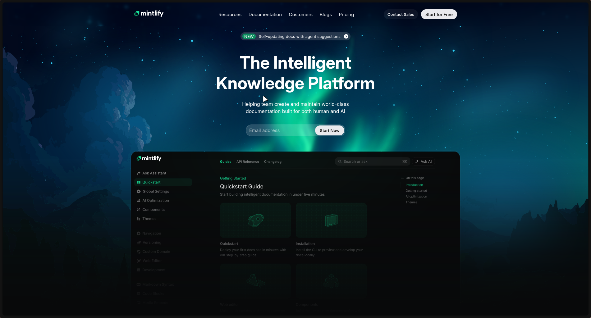
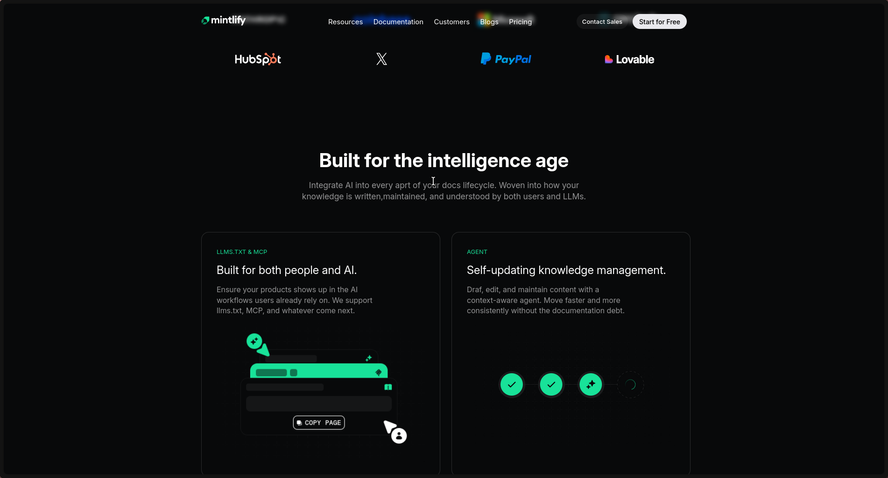

# Mintlify-Landing Page clone 

## Color Codes used 
    --border-color: #93939426;
    --border-color: #93939440;
    --accent-color: #18DC95;
    --bg-shade: #151617;
    --text-secondary: #939394;
    --footer-color: #151617;
    --page-background-color: #08090A;
    --badge-background-color: #0C8C5E;
    --border-color : #ffffff33;
    
## Font Family used
    - Inter
    - Geist Mono

## how to Locally Setup the project
- Clone the repo  
`git clone https://github.com/Thebeast01/mintlify-landing-page`  
- cd into the folder and just run it via live server. 

